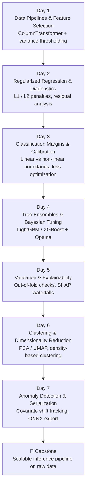
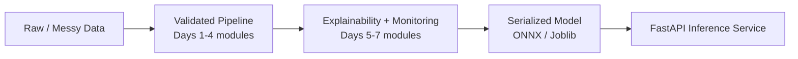

# Classical ML Mastery Sprint — 7 Days to Production-Ready Pipelines

> A hands-on sprint focused on the mechanics of classical machine learning — before moving on to deep learning.

---

## 📌 Context & Motivation

While building my previous project, **[Credit Risk Scorer & AI Advisor](#)**, I put together an end-to-end classification system: systematic EDA, feature engineering (outlier capping, SMOTE across 29 features), model benchmarking (Random Forest vs. Logistic Regression), and explainability via SHAP's `TreeExplainer`.

That project surfaced a gap worth closing deliberately: **knowing how to call a model is not the same as knowing which architecture actually fits a given dataset's scale, dimensionality, and latency budget.**

This repo is a focused 7-day sprint to nail down those classical ML mechanics before moving on to deep learning.

---

## 🎯 Objectives

This isn't a collection of isolated notebooks — each day builds toward a shared standard for handling real-world data constraints.

| Objective | What It Means in Practice |
|---|---|
| **Zero-Leakage Pipelines** | Strict `fit`/`transform` separation — no test-set information ever touches training statistics. |
| **Algorithmic Selection** | Benchmark linear models against tree ensembles to understand trade-offs across dataset sizes. |
| **Production Packaging** | Move past notebooks — serialize to ONNX/Joblib and serve via FastAPI. |

---

## 🗓️ 7-Day Architecture Plan



### Core Sprint (Days 1–4)

| Day | Focus | Key Techniques |
|---|---|---|
| 1 | Data Pipelines & Feature Selection | Modular `ColumnTransformer`, automated variance thresholding |
| 2 | Regularized Regression & Diagnostics | L1 / L2 penalties, residual error analysis |
| 3 | Classification Margins & Calibration | Linear vs. non-linear boundaries, business-loss optimization |
| 4 | Tree Ensembles & Bayesian Tuning | Gradient boosting (LightGBM / XGBoost), Optuna tuning |

### Advanced Topics (Days 5–7)

| Day | Focus | Key Techniques |
|---|---|---|
| 5 | Validation & Explainability (XAI) | Out-of-fold generalization checks, SHAP waterfall plots |
| 6 | Clustering & Dimensionality Reduction | PCA / UMAP latent space projection, density-based clustering |
| 7 | Anomaly Detection & Serialization | Covariate shift tracking, ONNX export with Pydantic schemas |

---

## 🚀 Capstone Implementation

Once the 7-day sprint wraps, every module gets integrated into a single **Capstone Project** — packaging the optimized classical models into a scalable inference pipeline that handles raw, messy data streams the way a live production system would.



---

## ⏭️ Future Roadmap

After this repo's classical ML capstone is validated, the same standards — rigorous validation, data hygiene, modular pipelines — carry over into a new repository focused entirely on **Deep Learning and custom neural network architectures**.

| Stage | Repository | Status |
|---|---|---|
| 1 | Credit Risk Scorer & AI Advisor | ✅ Complete |
| 2 | Classical ML Mastery Sprint (this repo) | 🚧 In Progress |
| 3 | Deep Learning & Custom Architectures | ⏳ Planned |

---

## 🛠️ Tech Stack

`scikit-learn` · `LightGBM` · `XGBoost` · `Optuna` · `SHAP` · `UMAP` · `ONNX` · `FastAPI` · `Pydantic`

---

## 📂 Repository Structure

```
.
├── day1_pipelines_feature_selection/
├── day2_regularized_regression/
├── day3_classification_calibration/
├── day4_tree_ensembles_optuna/
├── day5_validation_explainability/
├── day6_clustering_dim_reduction/
├── day7_anomaly_detection_serialization/
├── capstone/
└── README.md
```
